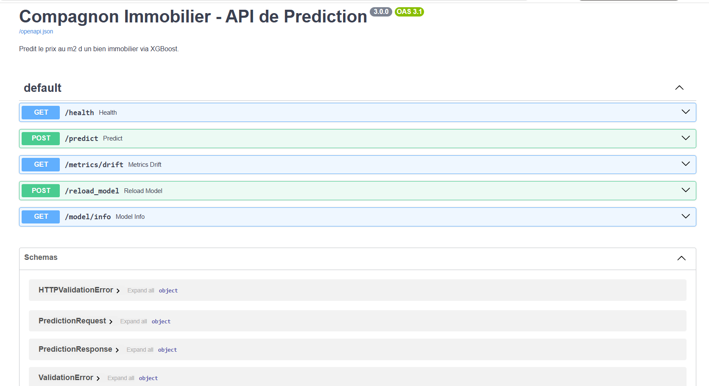
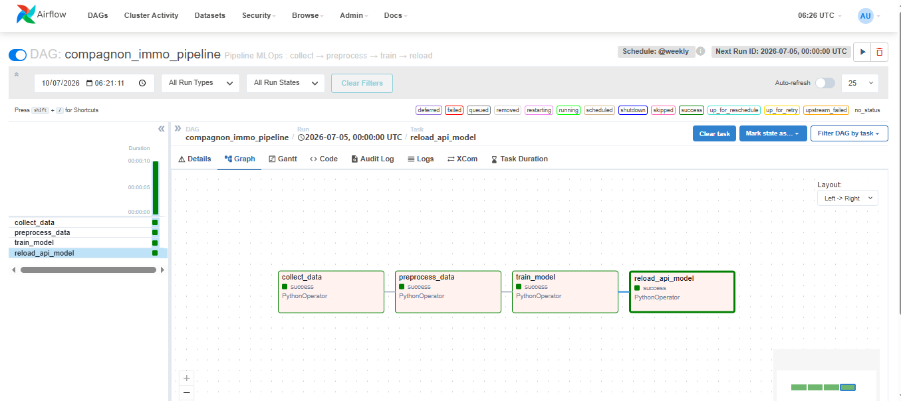
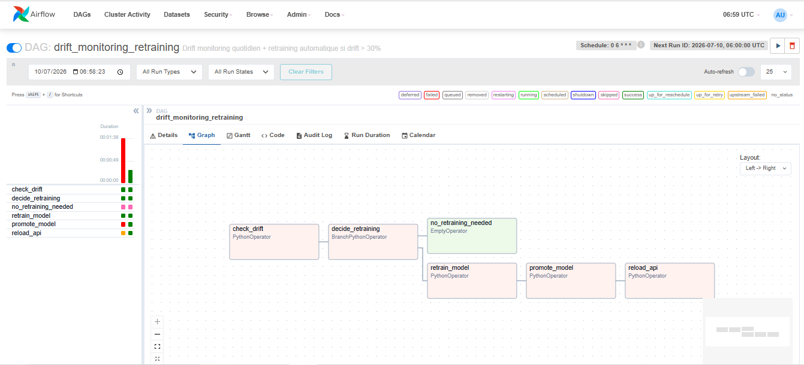
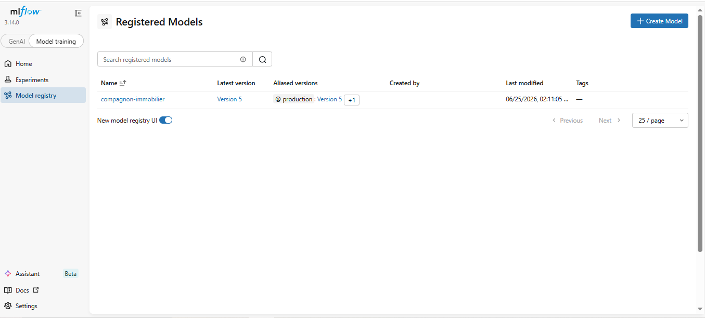
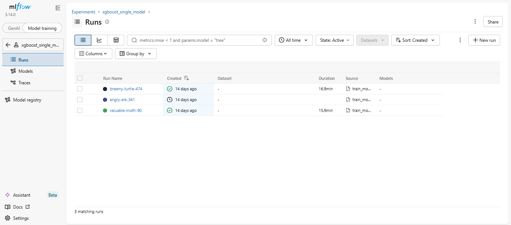
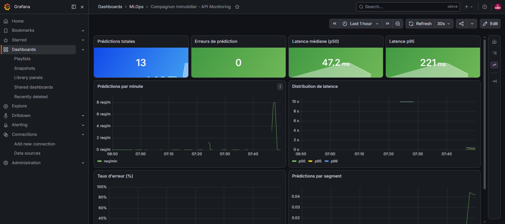
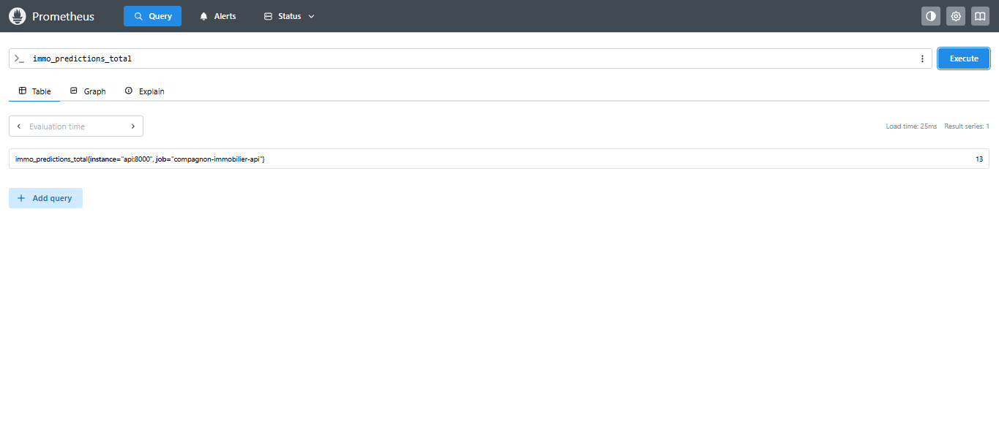
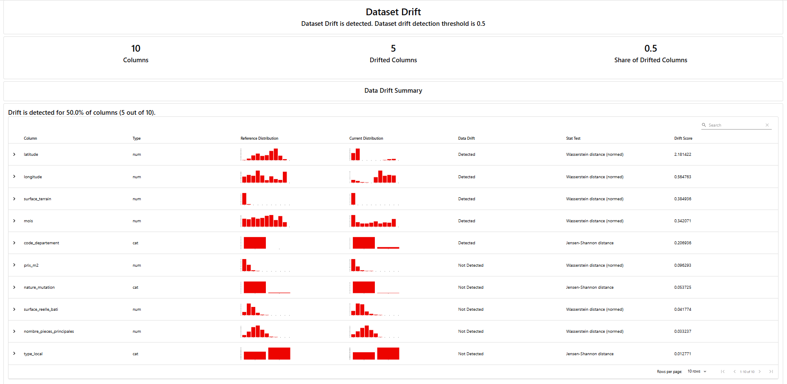
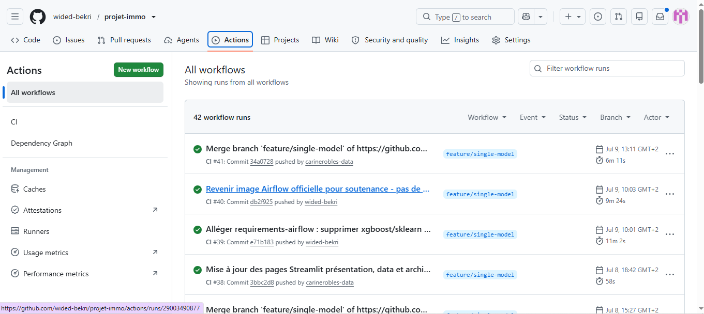

# 🏡 Compagnon Immobilier — Plateforme MLOps

> Industrialisation complète d'un modèle d'estimation immobilière : de la donnée brute DVF au service supervisé en production.


---

## 🎯 Contexte

Deux maisons identiques (100 m², 4 pièces) peuvent valoir **180 000 €** dans une commune rurale et **420 000 €** dans une zone tendue. La valeur d'un bien ne dépend pas uniquement de ses caractéristiques physiques — elle dépend de son territoire.

Ce projet adresse ce problème en deux axes :

| Axe | Objectif |
|---|---|
| 📊 **Data Science** | Transformer 20M+ transactions DVF en un modèle prédictif fiable (R²=0.80) |
| 🏗️ **MLOps** | Industrialiser ce modèle : déploiement conteneurisé, orchestration, monitoring, retraining automatique |

---

## 🏗️ Architecture — 10 Microservices Docker

```
┌─────────────────────────────────────────────────────────────────────┐
│                        docker-compose.yml                           │
│                                                                     │
│  ┌──────────┐    ┌──────────┐    ┌──────────┐    ┌──────────────┐  │
│  │Streamlit │───▶│  Nginx   │───▶│ FastAPI  │───▶│    MLflow    │  │
│  │  :8501   │    │ :80/443  │    │  :8000   │    │    :5000     │  │
│  └──────────┘    └──────────┘    └──────────┘    └──────────────┘  │
│                                       │                             │
│                              ┌────────▼────────┐                   │
│                              │   Prometheus     │                   │
│                              │     :9090        │                   │
│                              └────────┬────────┘                   │
│                              ┌────────▼────────┐                   │
│                              │    Grafana       │                   │
│                              │     :3000        │                   │
│                              └─────────────────┘                   │
│                                                                     │
│  ┌──────────────┐    ┌─────────────────┐    ┌──────────────────┐   │
│  │  PostgreSQL  │    │ Airflow WebUI   │    │ Airflow Scheduler│   │
│  │  (Airflow)   │    │    :8080        │    │   (2 DAGs)       │   │
│  └──────────────┘    └─────────────────┘    └──────────────────┘   │
└─────────────────────────────────────────────────────────────────────┘
```

---

## 🚀 Démarrage rapide

```bash
git clone https://github.com/wided-bekri/projet-immo.git
cd projet-immo
docker compose up -d
```

| Service | URL | Identifiants |
|---|---|---|
| Application Streamlit | http://localhost:8501 | — |
| API FastAPI (Swagger) | https://localhost/docs | API Key requise |
| MLflow | http://localhost:5000 | — |
| Airflow | http://localhost:8080 | admin / admin |
| Grafana | http://localhost:3000 | admin / admin |
| Prometheus | http://localhost:9090 | — |

---

## 📊 Données & Modèle

### Sources de données

| Source | Description | Apport |
|---|---|---|
| **DVF** | Demandes de Valeurs Foncières | 20M+ transactions notariales 2020–2025 |
| **DPE ADEME** | Diagnostics de Performance Énergétique | 1,35M logements appariés |
| **INSEE Filosofi** | Revenus et niveaux de vie | Revenu médian, taux de pauvreté par commune |
| **BPE** | Base Permanente des Équipements | Écoles, médecins, commerces |
| **SSMSI** | Statistiques de sécurité | Cambriolages, vols, violences |
| **SNCF** | Liste des gares voyageurs | Distance gare calculée via BallTree/Haversine |

**Après nettoyage :** 4,48M transactions · 31 variables · split 80/20

### Modèle XGBoost

```
n_estimators = 800
max_depth    = 8
learning_rate = 0.05
subsample    = 0.8
colsample_bytree = 0.8
```

**Approche résiduelle :**
```
target = prix_m2 - commune_prix_m2_type
prix_final = résiduel_prédit + commune_prix_m2
```

**Résultats :**

| Métrique | Valeur |
|---|---|
| R² | **0.80** |
| MAE | **648 €/m²** |
| RMSE | 1 014 €/m² |
| MAPE | 31,45 % |

---

## ⚡ API FastAPI

### Endpoints

| Méthode | Endpoint | Description |
|---|---|---|
| `POST` | `/predict` | Estimation du prix en €/m² |
| `GET` | `/health` | État de l'API et du modèle chargé |
| `GET` | `/model/info` | Version et métriques du modèle en production |
| `GET` | `/metrics` | Métriques Prometheus (usage interne) |
| `POST` | `/reload_model` | Rechargement du modèle depuis MLflow |

### Exemple d'appel

```bash
curl -X POST https://localhost/predict \
  -H "X-Api-Key: votre_cle" \
  -H "Content-Type: application/json" \
  -k \
  -d '{
    "surface_reelle_bati": 70,
    "nombre_pieces_principales": 3,
    "type_bien": "appart",
    "code_departement": "75",
    "commune_prix_m2": 10500,
    "dept_prix_m2": 10200
  }'
```

```json
{
  "prediction_eur_m2": 10850,
  "prediction_total_eur": 759500
}
```



---

## 🔄 Orchestration Airflow — 2 DAGs

### DAG 1 : `compagnon_immo_pipeline` (hebdomadaire)

```
collect_data → preprocess_data → train_model → reload_api_model
```



### DAG 2 : `drift_monitoring_retraining` (quotidien à 6h)

```
check_drift → decide_retraining → retrain_model → promote_model → reload_api
```

Si la dérive détectée par Evidently dépasse **30% des variables**, le cycle de retraining complet se déclenche automatiquement — sans intervention humaine.



---

## 📦 MLflow — Tracking & Model Registry

Chaque entraînement est tracé : paramètres, métriques, artefact du modèle.

**Promotion Champion/Challenger automatique :**
```python
if new_mae < prod_mae:
    client.set_registered_model_alias("compagnon-immobilier", "production", new_version)
else:
    client.set_registered_model_alias("compagnon-immobilier", "challenger", new_version)
```

FastAPI charge toujours le modèle avec l'alias `"production"` — sans modifier une ligne de code.




---

## 📈 Monitoring — Prometheus + Grafana

Prometheus scrape `api:8000/metrics` toutes les **15 secondes**.

**Métriques exposées :**
- `immo_predictions_total` — nombre total de prédictions
- `immo_prediction_errors_total` — erreurs de prédiction
- `immo_prediction_latency_seconds` — latence (P50/P95/P99)
- `immo_drift_share_of_columns` — part des variables en dérive
- `immo_drift_detected` — flag drift binaire




---

## 🔍 Détection de dérive — Evidently

Comparaison automatique entre les données de référence (2022) et les données actuelles (2024/2025).

| Résultat | Action |
|---|---|
| Dérive < 30% des variables | ✅ Rien — modèle stable |
| Dérive ≥ 30% des variables | 🔄 Retraining automatique déclenché par Airflow |



Rapports disponibles : [`monitoring/reports/`](monitoring/reports/)

---

## 🔒 Sécurité

- **HTTPS** via Nginx (certificats SSL auto-signés)
- **Rate limiting** : 10 requêtes/seconde par IP
- **Authentification** : header `X-Api-Key` obligatoire sur `/predict`
- **Isolation réseau** : FastAPI non exposé directement (derrière Nginx)
- **Métriques privées** : `/metrics` accessible uniquement en interne

---

## ✅ CI — GitHub Actions

À chaque push : **Ruff** (linting) + **Pytest** (6 tests unitaires).



**Tests couverts :**
- `test_health_ok` — `/health` retourne 200
- `test_predict_basic` — prédiction valide
- `test_predict_surface_negative` — 422 si surface ≤ 0
- `test_predict_type_bien_invalide` — 422 si type invalide
- `test_predict_maison` — prédiction maison
- `test_health_model_version` — version du modèle exposée

---

## 🗂️ Structure du projet

```
projet-immo/
├── app/                        # Application Streamlit (8 pages)
│   ├── app.py
│   ├── assets/style.css
│   ├── data/streamlit/         # Données pré-calculées pour l'app
│   └── pages/
│       ├── 0_Présentation_Projet.py
│       ├── 1_De_la_donnée_brute_à_la_donnée_prédictive.py
│       ├── 3_Architecture_Globale.py
│       ├── 4_Infrastructure_&_Microservices.py
│       ├── 5_Pipeline_&_Gouvernance.py
│       ├── 6_Déploiement_&_Inférence.py
│       ├── 7_Monitoring_&_Cycle_de_vie.py
│       └── 7_Estimation.py
├── dags/                       # DAGs Airflow
│   ├── compagnon_immo_pipeline.py
│   └── drift_monitoring_dag.py
├── dockerfiles/                # Dockerfiles par service
├── deployments/nginx/          # Config Nginx + certificats SSL
├── k8s/                        # Manifestes Kubernetes (scaling)
├── monitoring/                 # Config Prometheus, Grafana, Evidently
│   ├── prometheus.yml
│   ├── grafana/provisioning/
│   ├── drift_report.py
│   └── reports/
├── src/
│   ├── pipeline/train_model.py # Entraînement XGBoost + MLflow
│   └── services/inference/     # FastAPI — service d'inférence
├── tests/
│   ├── test_api.py
│   └── test_features.py
├── mlops/track_experiment.py   # Logging MLflow des expériences
├── docker-compose.yml
├── requirements.txt
└── Makefile
```

---

## 🛠️ Stack technique

| Catégorie | Technologies |
|---|---|
| **Modèle** | XGBoost, Scikit-learn, Pandas, NumPy |
| **API** | FastAPI, Pydantic v2, Uvicorn |
| **MLOps** | MLflow, DVC, DagsHub |
| **Orchestration** | Apache Airflow 2.9.1 |
| **Monitoring** | Prometheus, Grafana, Evidently |
| **Infra** | Docker, Docker Compose, Nginx |
| **Scaling** | Kubernetes (manifestes prêts dans `k8s/`) |
| **CI/CD** | GitHub Actions, Ruff, Pytest |
| **UI** | Streamlit |

---

## 👩‍💻 Auteur

**Wided El Bekri** — Machine Learning Engineer Junior  
[](https://linkedin.com/in/wided-bekri)
[](https://github.com/wided-bekri)

Projet de fin de formation — Machine Learning Engineer | Liora (ex-DataScientest) — 735h
